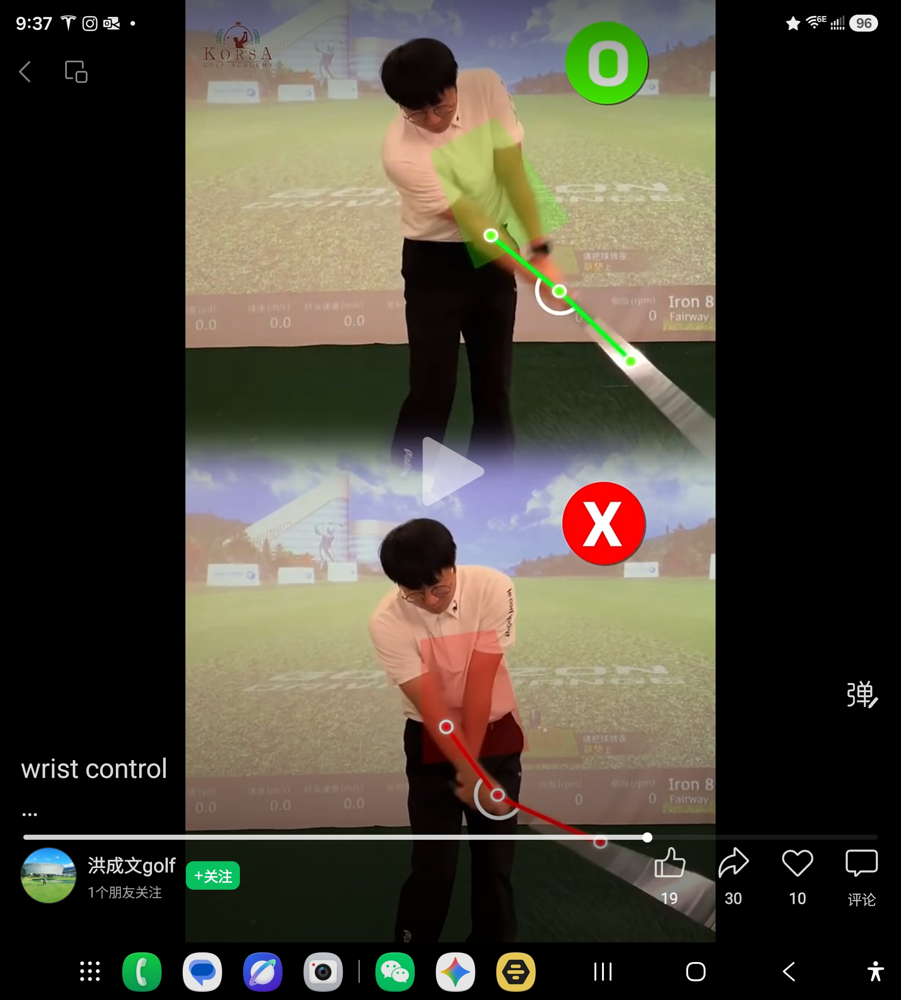
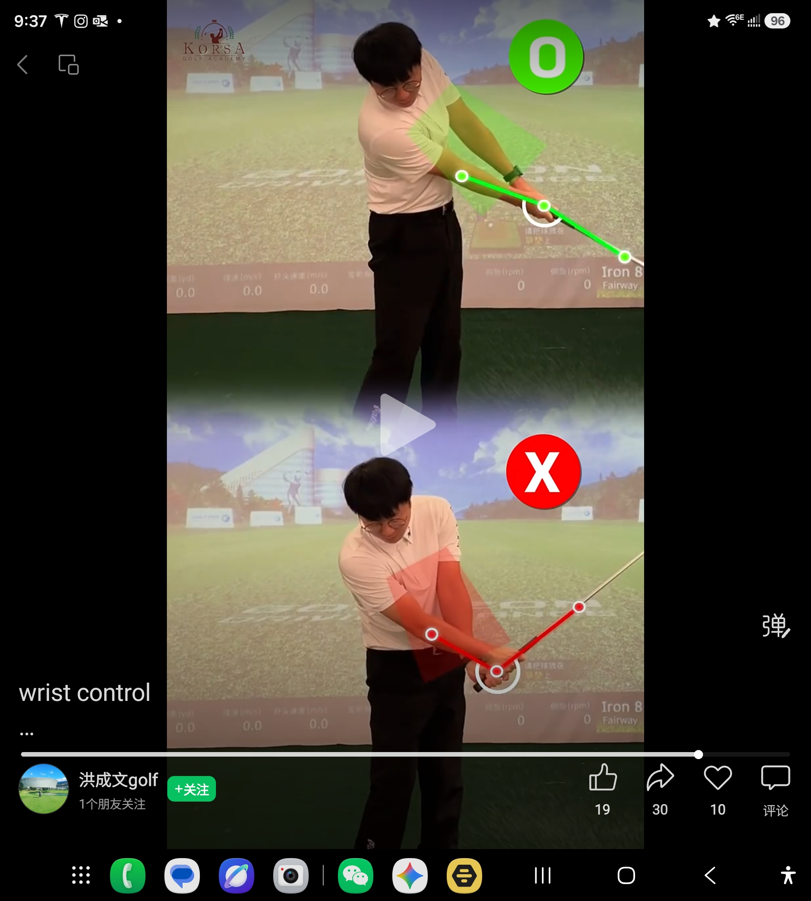

# 指示器样板库索引 SAMPLES_INDEX

> 本文件是 `INDICATOR_SAMPLE_DECODE_REPORT_v0.2.md` 的目录索引。
> **定位**: 永不自产内容。一句话读法一律逐字摘自报告原文；报告无对应条目者，标注「报告暂无条目，待 Jason 补录」。
> **来源标注**: 源:解构报告 v0.2（Jason 亲授裁决:_119/_120/_122/_135/_136/_181/_188/_190/_191；其余为报告基线解构，Jason 可后续抽查）
> **引用规范**: 文件名强绑定，禁相对编号（见 GT_IRON_RULES.md 铁律 CUE-C）
> **图片存放**: docs/07_CUE_DESIGN/reference_samples/（11MB，直接入 git）

---

| 文件名 | 缩略图 | 针对错误（摘自报告） | 三秒读法（逐字摘自报告） |
|--------|--------|---------------------|--------------------------|
| Image_20260602214110_117_1.jpg |  | 报告暂无条目，待 Jason 补录 | 报告暂无条目，待 Jason 补录 |
| Image_20260602214121_119_1.jpg |  | 转换期启动顺序错误（手先动 / 身体未启动） | "手别先动；髋先转、身体下坐，手最后跟"（Jason 亲授；注：素人实测仅读出 1/3 元素——时序语义静态图承载力不足的实证） |
| Image_20260602214124_120_1.jpg |  | 髋部平移（错）vs 髋部旋转（对），下杆时刻 | "髋部，下杆，红直箭头=髋平移（错），绿弧箭头=髋旋转（对）。箭头形状字典第三个独立互证样本" |
| Image_20260602214129_122_1.jpg |  | 红绿节点链 | "经设计的局部关节链+白圈节点是合法用户语言"（报告§3 法则7） |
| Image_20260602214138_125_1.jpg |  | 报告暂无条目，待 Jason 补录 | 报告暂无条目，待 Jason 补录 |
| Image_20260602214141_126_1.jpg |  | 报告暂无条目，待 Jason 补录 | 报告暂无条目，待 Jason 补录 |
| Image_20260602214144_127_1.jpg |  | 报告暂无条目，待 Jason 补录 | 报告暂无条目，待 Jason 补录 |
| Image_20260602214147_128_1.jpg |  | 报告暂无条目，待 Jason 补录 | 报告暂无条目，待 Jason 补录 |
| Image_20260602214216_135_1.jpg |  | 推杆顺序对照（本杆红杆） | "本杆红、下杆绿，跨杆红绿切换即产品叙事"（报告§4；与 _136 成对，为 Next-Swing Loop 原生句型） |
| Image_20260602214218_136_1.jpg |  | 推杆顺序对照（目标绿杆） | "本杆红、下杆绿，跨杆红绿切换即产品叙事"（报告§4；与 _135 成对，为 Next-Swing Loop 原生句型） |
| Image_20260705144248_181_1.jpg |  | 髋侧移（错）vs 髋旋转（对），P8 箭头字典互证 | "与 _181（侧移/转动）、_122 族并列，箭头形状字典三重互证：直=平移，弧=旋转"（报告§1） |
| Image_20260705144251_184_1.jpg |  | 报告暂无条目，待 Jason 补录 | 报告暂无条目，待 Jason 补录 |
| Image_20260705144252_185_1.jpg |  | 报告暂无条目，待 Jason 补录 | 报告暂无条目，待 Jason 补录 |
| Image_20260705144253_186_1.jpg |  | 报告暂无条目，待 Jason 补录 | 报告暂无条目，待 Jason 补录 |
| Image_20260705144253_187_1.jpg |  | 报告暂无条目，待 Jason 补录 | 报告暂无条目，待 Jason 补录 |
| Image_20260705144254_188_1.jpg |  | 色语义失误反例（原作者正确侧用红线） | "确认：原作者未遵循色语义，非行业惯例 → 色语义全局一致性由引擎强制"（报告§0 Jason 裁决） |
| Image_20260705144255_189_1.jpg |  | 报告暂无条目，待 Jason 补录 | 报告暂无条目，待 Jason 补录 |
| Image_20260705144256_190_1.jpg |  | 纯指令箭头（产品规则反例） | "产品 cue 必须'现状+指令'成对；纯指令仅练习模式；所有箭头细窄化，不得遮挡身体"（报告§0 Jason 裁决） |
| Image_20260705144257_191_1.jpg |  | 转换期正确顺序（专家盲区风险样本） | "真值：顶点转换期，正确顺序=身体先下坐+髋旋转，杆自然下落；绿箭头=正确下落方向。专家盲区风险样本（专家秒懂/素人读不出）"（报告§0+§1 Jason 裁决；制度产出：双轨验收） |

---

## 补录说明

报告 v0.2 对以下 10 张无显式解构条目：
_117 / _125 / _126 / _127 / _128 / _184 / _185 / _186 / _187 / _189

这 10 张在 v0.1/v0.2 报告中均未出现针对错误描述或三秒读法。后续补录方式：
Jason 口述读法 → Hermes 逐字写入本 INDEX 并更新解构报告 → 提升为「报告基线解构」或「Jason 亲授」标注。

---

*SAMPLES_INDEX v1.1 — 修订于 CUE-002 补正 2026-07-05*
*定位: 报告目录索引，永不自产内容。所有读法来源见各行标注。*
